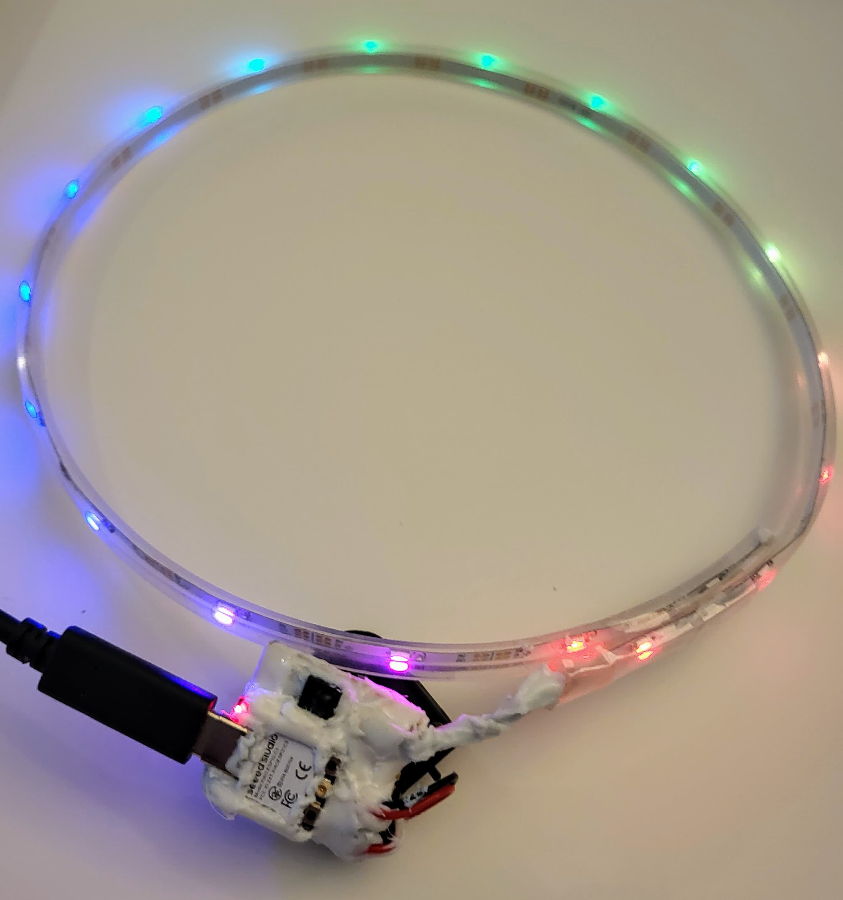
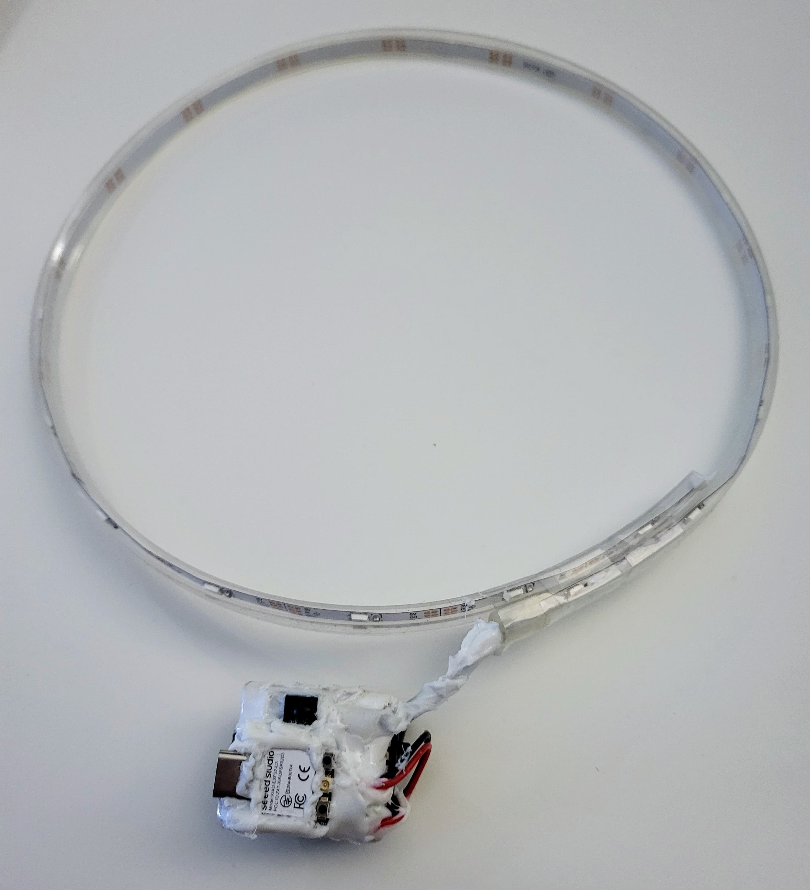
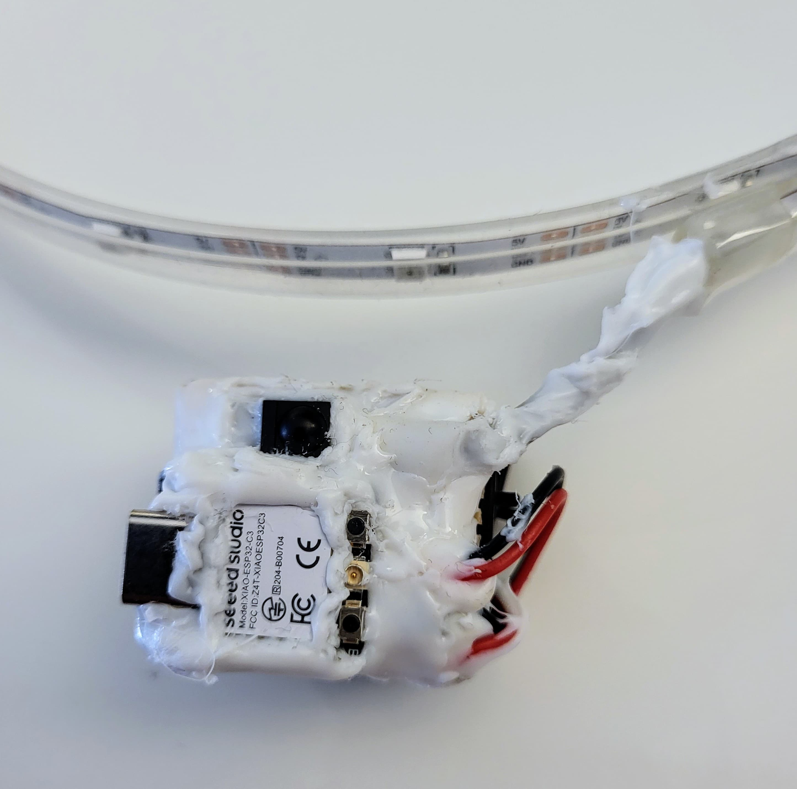
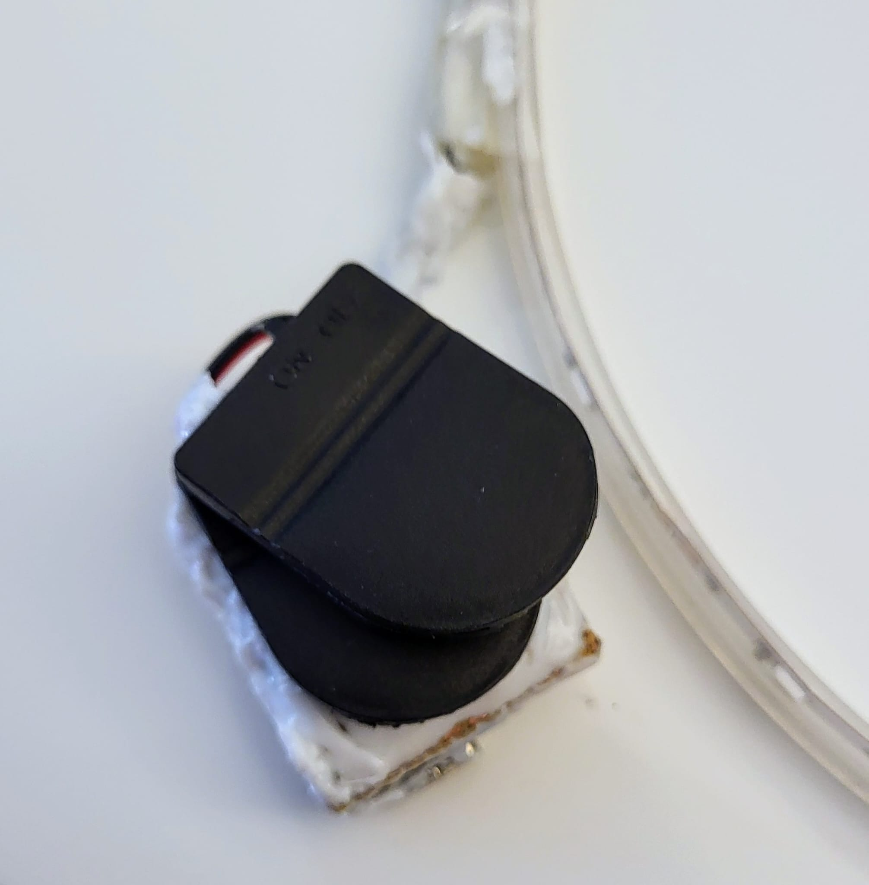

# The Eras Tour - LED Project

My goal here was to create an LED strip which will light up in sync with the Pixmob LED bracelets, controlled by the IR senders inside the stadium.

Unfortunately, I did not get the chance to actually try it out (Vienna...).

The IR commands in this project are based on the [pixmob-ir-reverse-engineering](https://github.com/danielweidman/pixmob-ir-reverse-engineering) project,
including the file in [this issue](https://github.com/danielweidman/pixmob-ir-reverse-engineering/issues/13).

`receiver/effects.h` contains all signals (as uint64) which I've found the Eras Tour Bracelet to respond to.

 
 

### Hardware
* 1x [Seeed Studio XIAO ESP32C3](https://www.mouser.de/ProductDetail/Seeed-Studio/113991054?qs=3Rah4i%252BhyCHVBerMrpzCkw%3D%3D)
* 1x [Vishay TSOP4436 IR Receiver](https://www.mouser.de/ProductDetail/Vishay-Semiconductors/TSOP4436?qs=9Cg39qEKpi4wCNZSvf6qEw%3D%3D)
* 1x [Adafruit Mini Skinny NeoPixel RGB LED Strip](https://www.mouser.de/ProductDetail/Adafruit/2953?qs=ivJcBTDythWo3KcYUoUS1A%3D%3D) (1m)
* 2x [LIR2032H 3.7V 70mAh Button Cell](https://amzn.eu/d/3eSunD8)
* 2x [Button Cell Holder](https://amzn.eu/d/a9WcBUC)

Two LIR2032H cells (in parallel) are connected to the battery connector on the back side.

 

The LED strip is connected directly to `BAT+`, `D7` and `GND`.

The IR receiver is connected directly to `3V3`, `D10` and `GND`.

Source: https://wiki.seeedstudio.com/XIAO_ESP32C3_Getting_Started/

### Dependencies
* Arduino IDE 2.3.2 (Important, older versions do not work properly with the ESP32 Boards in my experience)
* ESP32 Boards Package 2.0.17
* [Adafruit Neopixel](https://github.com/adafruit/Adafruit_NeoPixel) Library 1.12.3
* [Arduino-IRremote](https://github.com/Arduino-IRremote/Arduino-IRremote) Library 4.4.0

### Usage
